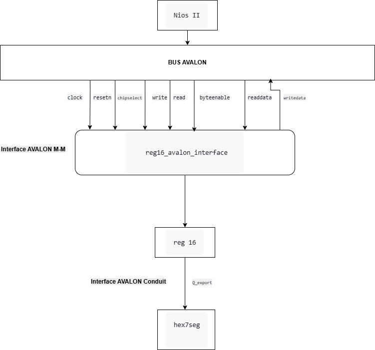

# Architecture du système Qsys avec composant personnalisé Avalon

## 1. Introduction

Ce TP consiste à intégrer un composant matériel personnalisé dans un système embarqué basé sur un processeur Nios II sur FPGA DE1.

L’objectif principal est de :

- créer un périphérique matériel personnalisé (`reg16`)
- l’intégrer dans Qsys
- permettre au processeur Nios II de communiquer avec ce périphérique via le bus Avalon
- afficher la valeur du registre sur les afficheurs 7 segments de la carte DE1


---

# 2. Architecture globale du système



---

# 3. Description des fichiers

| Fichier | Rôle |
|---|---|
| `DE1_Basic_Computer.vhd` | Top-level du FPGA |
| `nios_system.qsys` | Système Qsys contenant le Nios II et les périphériques |
| `reg16.vhd` | Registre matériel 16 bits |
| `reg16_avalon_interface.vhd` | Interface Avalon du composant personnalisé |
| `hex7seg.vhd` | Décodeur pour les afficheurs 7 segments |

---

# 4. Description du composant personnalisé

Le composant personnalisé est constitué de deux blocs :

- `reg16` : stockage des données
- `reg16_avalon_interface` : interface entre le bus Avalon et le registre

Le registre `reg16` ne communique pas directement avec le processeur.

Toute la communication avec le système Qsys passe par `reg16_avalon_interface`.

---

# 5. Interfaces Avalon utilisées

Le composant personnalisé possède deux interfaces Avalon différentes :

| Interface | Type | Rôle |
|---|---|---|
| Avalon Memory-Mapped | Avalon-MM | communication avec le processeur Nios II |
| Avalon Conduit | Avalon Conduit | exportation des données vers l’extérieur |


---

# 6. Interface Avalon-MM

## Rôle

L’interface Avalon-MM permet au processeur Nios II :

- d’écrire dans le registre
- de lire le contenu du registre

Le composant agit comme un **slave Avalon-MM**.

Le processeur Nios II agit comme un **master Avalon-MM**.

---

## Signaux Avalon-MM utilisés

Dans `reg16_avalon_interface.vhd`, les signaux utilisés sont :

| Signal | Rôle |
|---|---|
| `clock` | horloge système |
| `resetn` | reset actif à 0 |
| `write` | demande d’écriture |
| `read` | demande de lecture |
| `chipselect` | sélection du composant |
| `writedata` | données envoyées par le Nios II |
| `readdata` | données retournées au Nios II |
| `byteenable` | validation des données |

---

# 7. Interface Avalon Conduit

## Rôle

L’interface Conduit permet d’exporter des signaux hors du système Qsys.

Dans ce TP, elle sert à envoyer la valeur du registre vers les afficheurs 7 segments.

---

## Signal utilisé

Le signal Conduit utilisé est :

```vhdl
Q_export
```

Ce signal contient la valeur du registre 16 bits.


